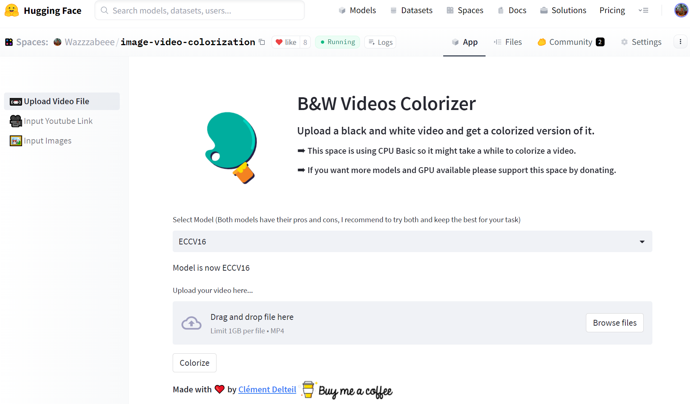

# Image Video Colorization
This project was conceived as part of the "Sujets Spéciaux" course at UQAC under the supervision of [Kevin Bouchard](http://www.kevin-bouchard.ca/)

## Objective
The aim was to deploy a video image colorization application. To this end, I have taken up the GitHub project of [Richard Zhang and his co-authors](https://github.com/richzhang/colorization) with models and papers presented at ECCV16 and SIGGRAPH17. Their solutions are based on convolutional neural networks.

The interface for the models was designed on Streamlit and deployed in a [Space on Hugging Face](https://huggingface.co/spaces/Wazzzabeee/image-video-colorization).

The following features are available:
- Colorization of a batch of images.
- Colorization of MP4, MKV and AVI video files.
- Colorization of Youtube videos.

## Interface

## Todos
Other models based on GANs will probably be implemented in the future if my application for a community grant to gain access to a GPU on Hugging Face is successful.

## References
1. Richard Zhang, Phillip Isola et Alexei A Efros. « Colorful Image Colorization ». In : ECCV. 2016.
2. Richard Zhang et al. « Real-Time User-Guided Image Colorization with Learned Deep Priors ». In : ACM
Transactions on Graphics (TOG) 9.4 (2017).
